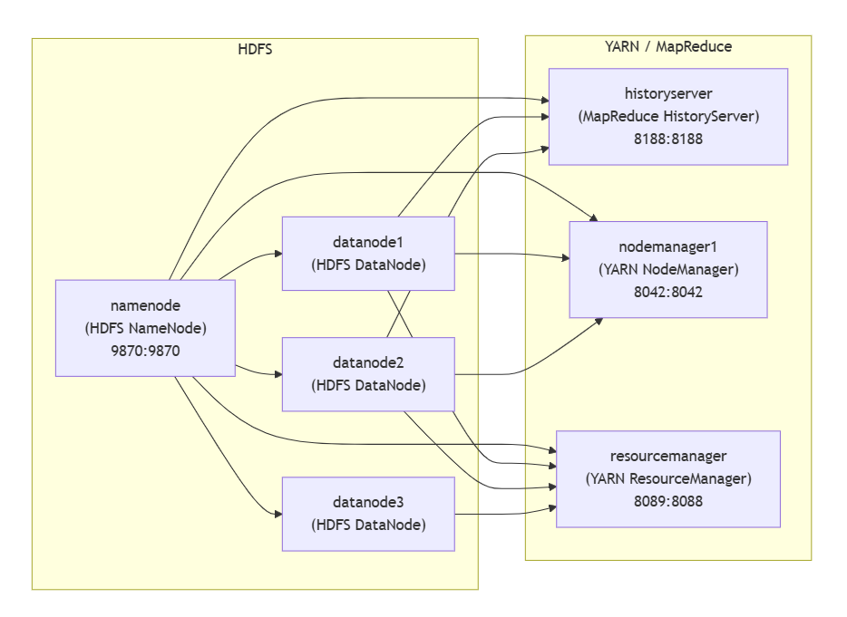

### Arquitectura del Clúster `docker-compose.yml`
Se trata de un clúster HDFS con 1 maestro y 3 workers, y un clúster YARN con 1 maestro y 1 solo worker:

* **HDFS**
  * `namenode` (puerto expuesto: `9870:9870`)
  * `datanode1`, `datanode2`, `datanode3` (dependen del `namenode`)
* **YARN / MapReduce**

  * `resourcemanager`
  * `nodemanager1` (depende de `resourcemanager`/HDFS según el compose)
  * `historyserver` (puerto expuesto: `8188:8188`; depende de NN y DNs)

El diagrama muestra los servicios maestros (Master) y trabajadores (Worker) para HDFS (almacenamiento) y YARN (procesamiento).

```
                                [ Clúster Hadoop Docker ]
                                          │
                  ┌───────────────────────┴───────────────────────┐
                  │                                               │
      [ Servicios MAESTROS (Master) ]                 [ Servicios TRABAJADORES (Worker) ]
      │                                               │
      ├── 🧠 NAMENODE (Master HDFS)                   ├── 💾 DATANODE 1 (Worker HDFS)
      │    (Puerto: 9870)                             │
      │                                               ├── 💾 DATANODE 2 (Worker HDFS)
      ├── 💼 RESOURCEMANAGER (Master YARN)            │
      │    (Puerto: 8089)                             ├── 💾 DATANODE 3 (Worker HDFS)
      │                                               │
      └── 📜 HISTORYSERVER (Servicio YARN)            └── 💻 NODEMANAGER 1 (Worker YARN)
           (Puerto: 8188)                                  (Puerto: 8042)
```


```
       ***********************************
       * Arquitectura Clúster Hadoop    *
       * (Segun docker-compose.yml)   *
       ***********************************
                     |
                     |
+--------------------+---------------------+
|                                          |
|                                          |
+---[ Servicios MAESTROS (Master) ]---+    +---[ Servicios TRABAJADORES (Worker) ]---+
|                                      |    |                                         |
|   +-----------------------------+    |    |   +--------------------------------+    |
|   | NAMENODE                    |    |    |   | DATANODE 1                     |    |
|   | (Master HDFS)               |    |    |   | (Worker HDFS)                  |    |
|   | (Puerto: 9870)              |    |    |   +--------------------------------+    |
|   +-----------------------------+    |    |                                         |
|                                      |    |   +--------------------------------+    |
|   +-----------------------------+    |    |   | DATANODE 2                     |    |
|   | RESOURCEMANAGER             |    |    |   | (Worker HDFS)                  |    |
|   | (Master YARN)               |    |    |   +--------------------------------+    |
|   | (Puerto: 8089 <- 8088)      |    |    |                                         |
|   +-----------------------------+    |    |   +--------------------------------+    |
|                                      |    |   | DATANODE 3                     |    |
|   +-----------------------------+    |    |   | (Worker HDFS)                  |    |
|   | HISTORYSERVER               |    |    |   +--------------------------------+    |
|   | (Servicio YARN)             |    |    |                                         |
|   | (Puerto: 8188)              |    |    |   +--------------------------------+    |
|   +-----------------------------+    |    |   | NODEMANAGER 1                  |    |
|                                      |    |   | (Worker YARN)                  |    |
+--------------------------------------+    |   | (Puerto: 8042)                 |    |
                                            |   +--------------------------------+    |
                                            |                                         |
                                            +-----------------------------------------+
```




### Análisis de la Arquitectura

**1. Servicios Maestros (Masters):**

  * `namenode`: Es el cerebro del sistema de archivos HDFS. Administra el *namespace* de los archivos (dónde se ubican los datos).
  * `resourcemanager`: Es el cerebro de YARN (el sistema de procesamiento). Asigna recursos (CPU, memoria) a las aplicaciones.
  * `historyserver`: Un servicio auxiliar de YARN que registra el historial de las aplicaciones completadas.

**2. Servicios Trabajadores (Workers):**

  * **Almacenamiento (HDFS):** Tienes **3 nodos de datos** (`datanode1`, `datanode2`, `datanode3`). Estos contenedores son responsables de almacenar los bloques de datos reales.
  * **Cómputo (YARN):** Tienes **1 solo nodo de cómputo** (`nodemanager1`). Este contenedor es el que ejecuta las tareas y reporta su estado al 

### Características

  * **Arquitectura Asimétrica:** Esta es una configuración inusual. Tienes 3 "brazos" para almacenar datos, pero solo 1 "brazo" para procesarlos. En un clúster típico, cada `datanode` suele correr junto a un `nodemanager` en la misma máquina (o, en este caso, se configurarían 3 `nodemanager`s, uno por cada `datanode`).
  * **Orden de Arranque (`depends_on`):**
      * El `namenode` es el servicio fundamental. Casi todos los demás servicios (`resourcemanager`, `historyserver`, `nodemanager1`, y todos los `datanode`s) dependen de él y no arrancarán hasta que esté listo.
      * El `resourcemanager` es el más dependiente: espera a que *todos* los nodos (el `namenode` y los 3 `datanode`s) estén activos antes de iniciarse.
  * **Volúmenes:** Has configurado volúmenes persistentes (`hadoop_namenode`, `hadoop_datanode1`, etc.). Esto es excelente, ya que significa que los datos de HDFS no se perderán si reinicias los contenedores.

